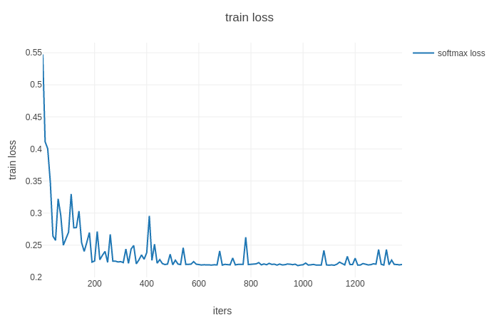
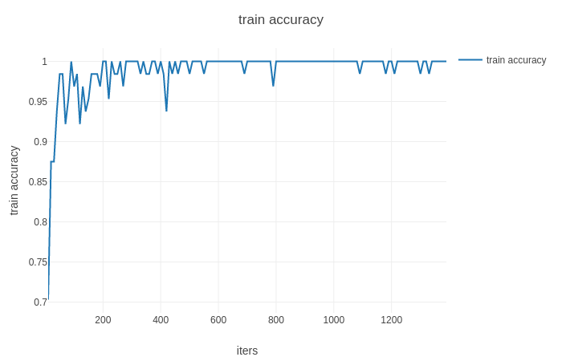

# Face-anti-spoofing
The face anti-spoofing is an technique that could prevent face-spoofing attack. For example, an intruder might use a photo of the legal user to "deceive" the face recognition system. Thus it is important to use the face anti-spoofint technique to enhance the security of the system.
<br>


All the face images listed below are in the dataset of CASIA-FASD

 
## Usage
### Main Dependencies
 ```
 Python 3 and above
 torch==1.0.1 
 numpy==1.16.2
 tqdm==4.15.0
 easydict==1.7
 matplotlib
 pillow==5.0.0
 ```
# Prepare Dataset
CASIA-FASD datasets are consist of videos, each of which is made of 100 to 200 video frames. For each video, I captured 30 frames (with the same interval between each frame). Then, with the Haar_classifier, I was able to crop a person’s face from an image. These images make up training datasets and test datasets. 

### Train and Test
Note: If you want to test that the model is pretrained and working properly, I've added some test images from different classes in directory 'data/'. All of them are classified correctly.


## Benchmarking
In my implementation, I have achieved approximately 1140 MFLOPS. The paper counts multiplication+addition as one unit. My result verifies the paper as roughly dividing 1140 by 2 is equal to 569 unit.

## Updates
* Inference and training are working properly.


